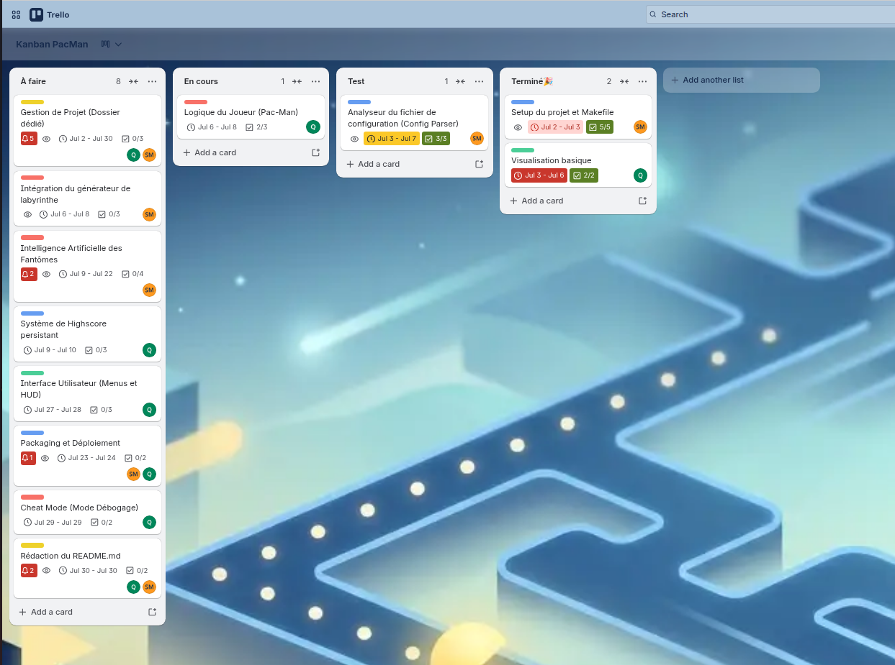
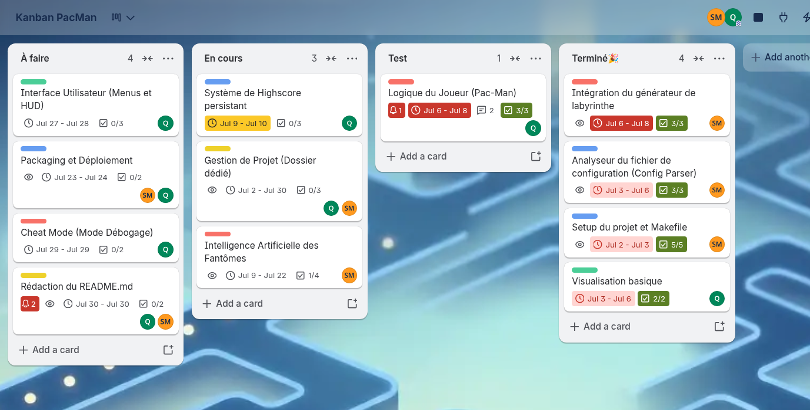
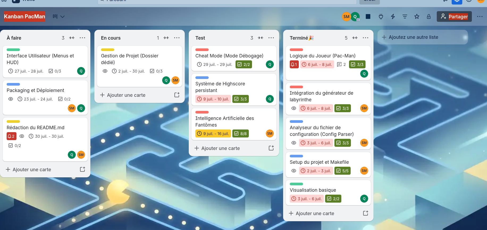
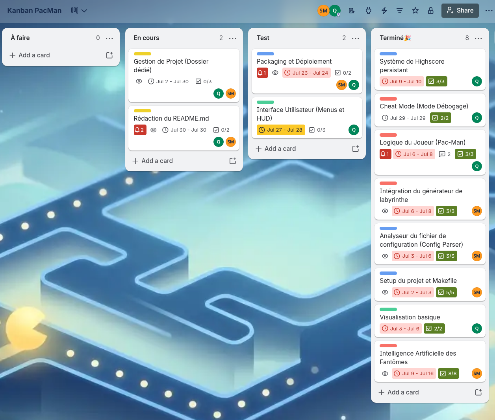

# Project Management with Trello and Kanban

We used Trello and a Kanban board to manage the project, which helped us visualize tasks, track progress, and keep the team aligned. This approach improved transparency, made priorities clear, and allowed us to quickly adapt to changes while maintaining a smooth workflow.

**Example: J2**

 
  

   

**Example: J5**

 
  

   

**Example: J9**

 
  

   

**Example: J12**

 
  

   

