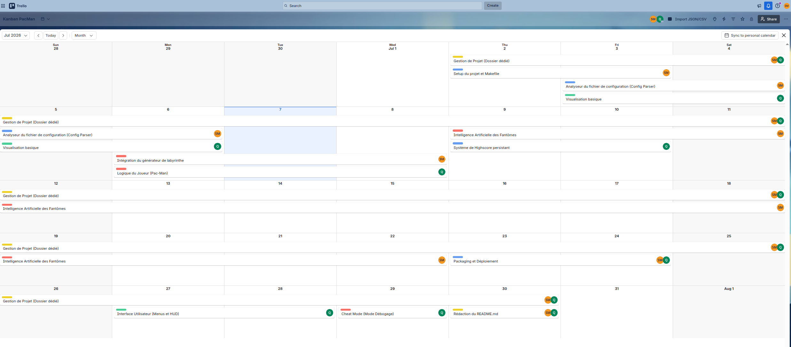
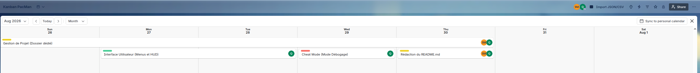
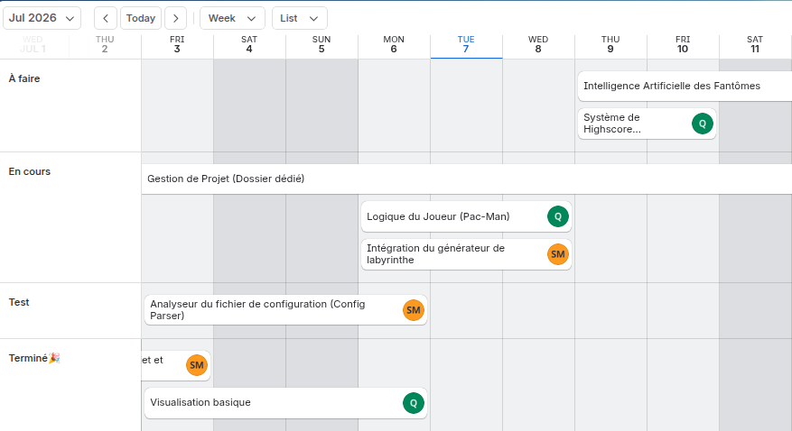

# Timeline for Project Planning

A timeline shows tasks, key dates, and goals in order. It helps teams plan ahead, see what comes next, and adjust when things change. This makes it easier to stay on track and update the plan as the project moves forward.

**Overview**

 
  

   

 
  

   

**Focus on days 1-3**

 
  

   

